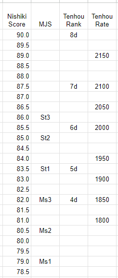

These charts show average Naga scores for various Ranks on MJS or Tenhou. The data comes from Naga analysis of my own MJS games and Tenhou games kindly sent by Razout aka Enzegeitor. The results of myself and Razout are excluded to reduce bias.

To start with the conclusion, this chart shows each MJS rank, Tenhou dan rank, and Tenhou Rating bin and their average Nikishi score.

<kbd></kbd>

Roughly MJS Master 3 = Tenhou 4d = Tenhou 1850R. And MJS Saint 3 = Tenhou 7d = Tenhou 2050R. 

Here are individual charts for MJS and Tenhou, starting with MJS. The Red Xs above and below each datapoint shows a +/- 2 Standard Error range. The blue line is a 2nd degree polynomial fit.

<kbd></kbd>

Similar for Tenhou Dan (note the very large error range for 7d and 8d -- there were very few data points for these in the dataset)

<kbd></kbd>

And Tenhou Ranks binned every 50 points. 1800 means the range \[1800-1850\). Again note the very large errors on the 2050+ ranges.

<kbd></kbd>

And similar graphs for percentage of bad mistakes for MJS

<kbd></kbd>

Percentage of bad mistakes for Tenhou by Dan

<kbd></kbd>

Percentage of bad mistakes for Tenhou by Rate

<kdb></kbd>

Data from January 2023 and earlier. Naga Nishiki version 2.2