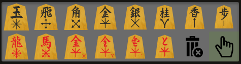
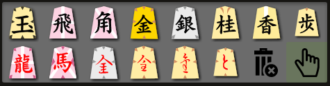
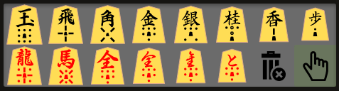
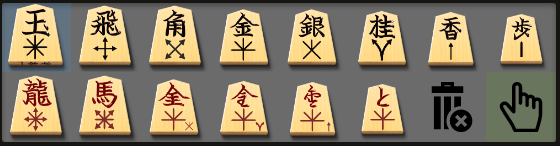
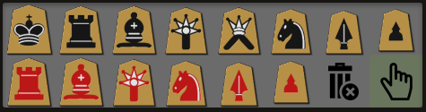
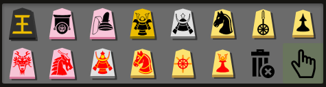
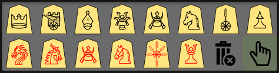
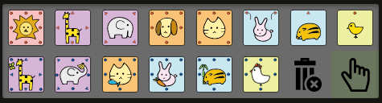
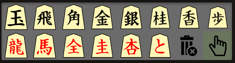
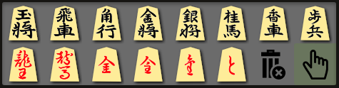

# lishogi piece sets
lishogi has many options for how the pieces look:
  * Click your username in the upper right, and Piece Set
  * The traditional sets use Japanese character (Kanji) which takes more time to get used to if you cannot read Japanese
  * There are many beginner friently sets that make it quicker to learn how each piece moves.
    * But many resources will only use traditional sets
  * Types of beginner sets:
    * Use traditional Japanese Kanji, but also have hints on how they move
    * Use Western chess style pieces
    * Pieces that visually cue how the pieces move

## Beginner sets with Kanji included
* I recommend these so you naturally start to recognize the Kanji alone
  * (Important for sites that only have the Kanji)

### Shogi_cz

  * \+ I recommend this set
  * \+ The bottom shows how the pieces move
  * \+ The top has traditional Kanji
  * \+ 81dojo also has this set so you can use it on both sites
  * \- Kanji and move guide share space, making both smaller
  * \- No border on pieces so they bleed into the board (pick a board color with good contrast)

### Kanji_Guide_Shadowed (aka the Tiger Stripe set)

  * \+ Another good choice
  * o Uses multiple colors for different pieces
    * Gold and Silver generals are colored Gold and Silver
  * \+ Move guide is small so the Kanji is larger
  * \- Move guide is small, harder to see

### Valdivia

  * \+ Another good choice, similar to Shogi_cz

### Portella_cz

  * [Link](https://userstyles.org/styles/241246/portella-cz) to this custom chrome plugin by ShogiExplained 
  * \+ Beautiful version of Shogi_cz
  * \- Requires third party Chrome plugin

## Beginner sets without Kanji
* Some of these are good, but the big drawback is you don't have an easy transition to traditional Kanji

### western

  * \+ Borrows Western chess for pieces that crossover
  * \+ Gold General, Silver General, and Lance designs hint how they move
  * \- No easy bridge to traditional Kanji

### Intl_Colored_3d

  * Similar to western

### international

  * Similar to western
  
### Doubutsu

  * \+ Cute!
  * \-- The tops are not slanted to indicate which side owns them (a huge minus!)
  * \- No easy bridge to traditional Kanji
    * \-- The piece names (dog, cat, etc) do not match with the Japanese name (Gold, Silver, etc)

## Traditional sets
### kanji_light

### orangian

